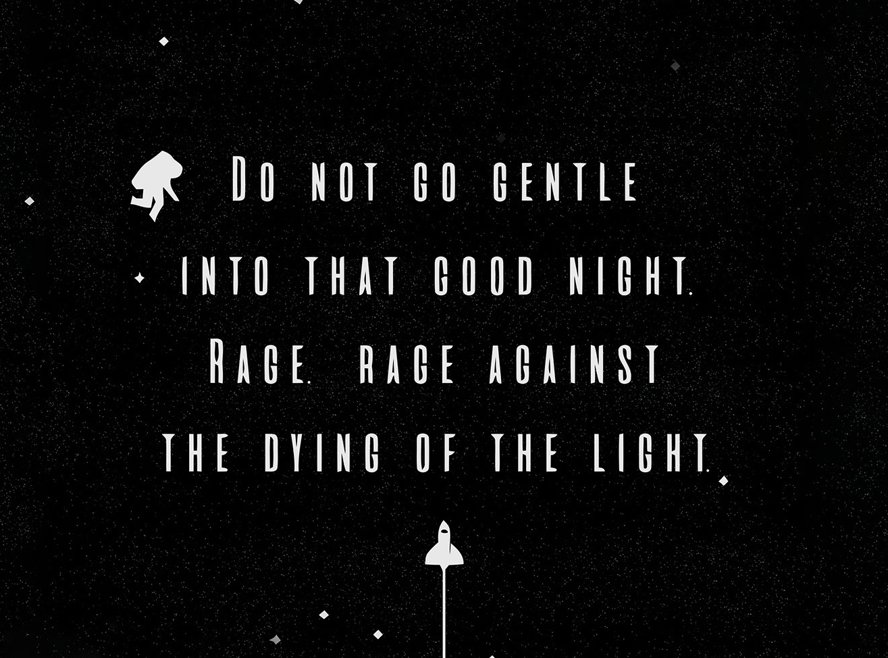

<!-- 🧑🏻‍💻 HEADER / BANNER -->
<p align="center">
  
</p>

<h1 align="center">👋 Hi, I'm Archit Kaushik</h1>

<p align="center">
  💻 Advanced App Engineering Analyst @ <strong>Accenture</strong><br>
  🚀 Full Stack & Dynamics AX Developer | Dreaming Big | Constantly Learning<br>
  🌍 Based in Gurgaon, India
</p>

---

```yaml
name: Archit Anurag Kaushik
located_in: Gurgaon, India
job: Advanced App Engineering Analyst @ Accenture
education:
  - B.Tech in Electronics & Communication, Thapar University
fields_of_interest:
  - Web Development
  - System Design & DSA
  - Cloud Computing
  - AI Automation & Agentic Coding
technical_background:
  - Microsoft Dynamics AX (X++)
  - Full-Stack Development (MERN)
  - Database Design & SQL Optimization
currently_learning:
  - React.js
  - Node.js
  - Advanced JavaScript
  - Tailwind CSS
will_learn:
  - TypeScript
  - Next.js
  - Express.js
  - MongoDB
  - AWS & Docker
hobbies:
  - Cycling 🚴‍♂️
  - Coding ☕
  - Journaling 📖
  - Yoga 🧘‍♂️
  - Creating Personal Projects 💡
## Hi there 👋

<!--
**Archit-bit/archit-bit** is a ✨ _special_ ✨ repository because its `README.md` (this file) appears on your GitHub profile.

Here are some ideas to get you started:

- 🔭 I’m currently working on ...
- 🌱 I’m currently learning ...
- 👯 I’m looking to collaborate on ...
- 🤔 I’m looking for help with ...
- 💬 Ask me about ...
- 📫 How to reach me: ...

-->
